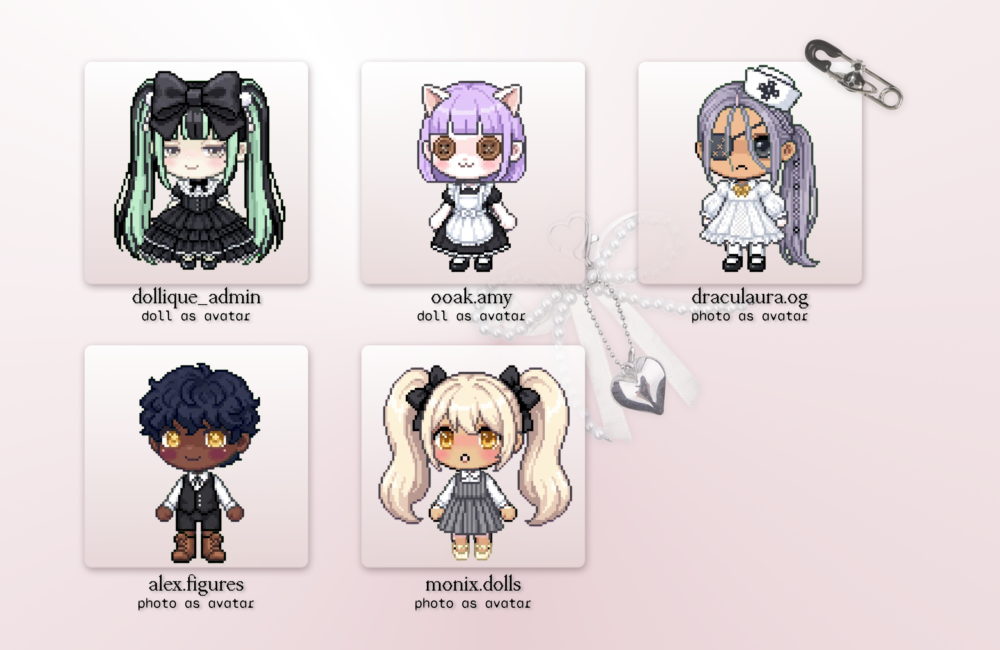
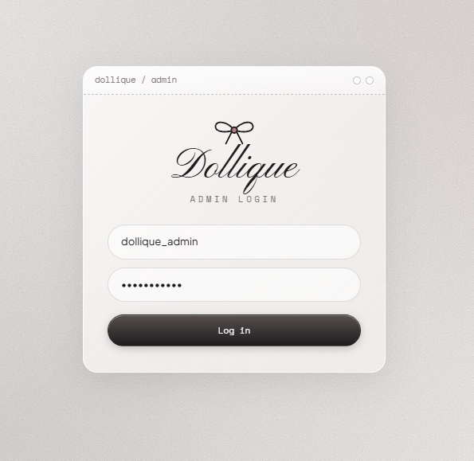
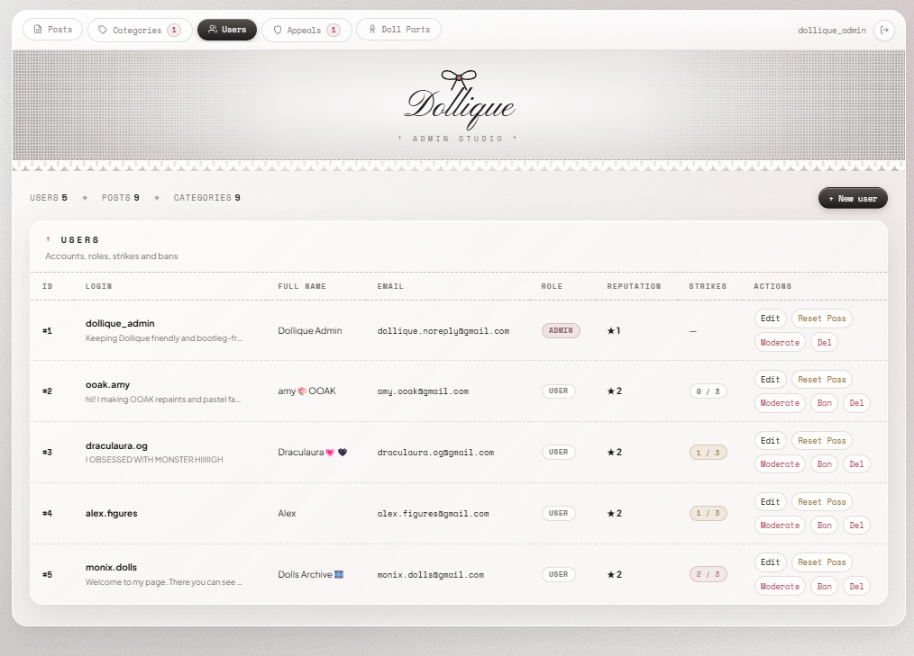
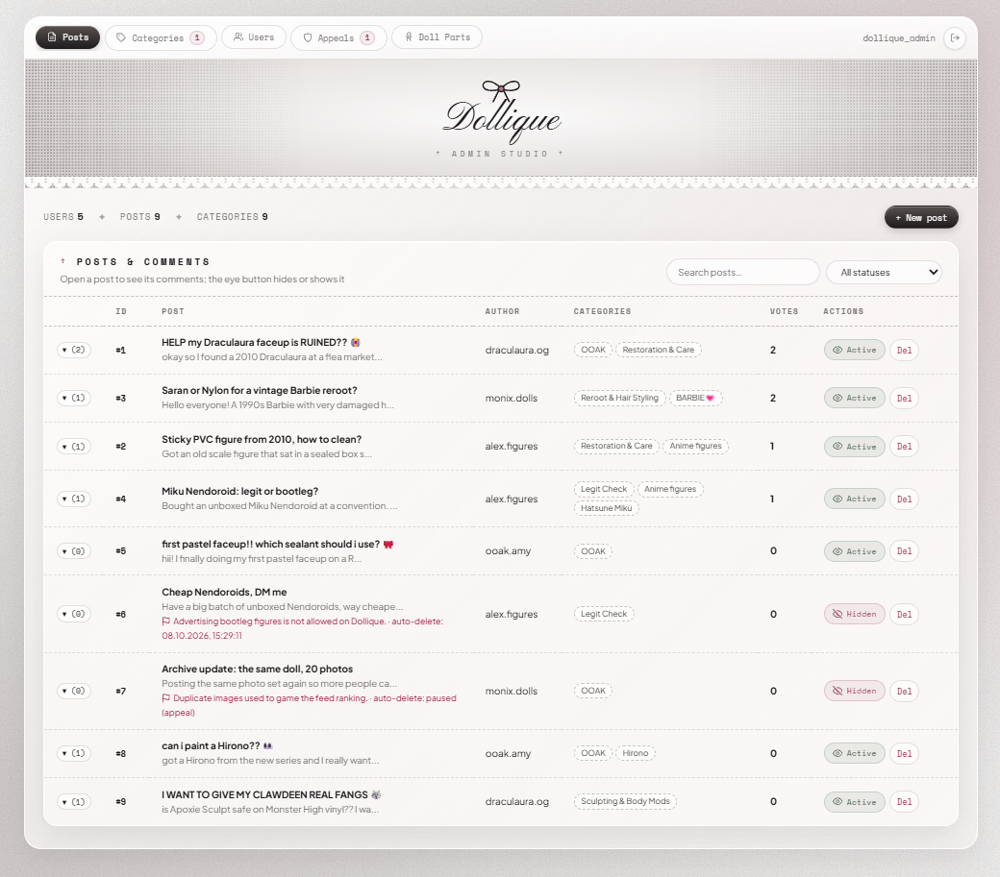
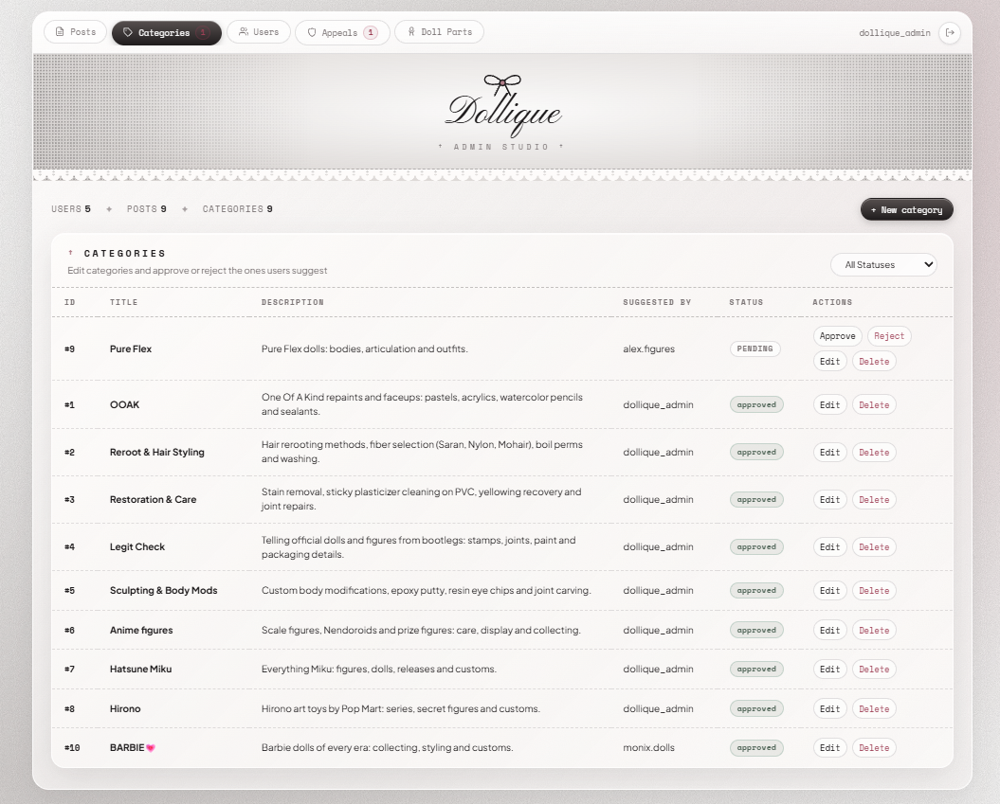
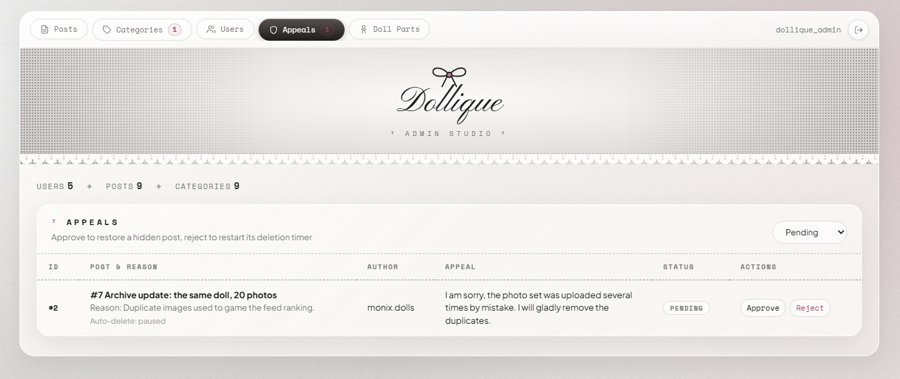
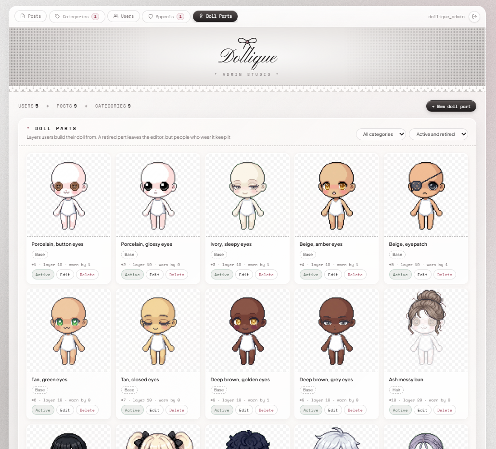
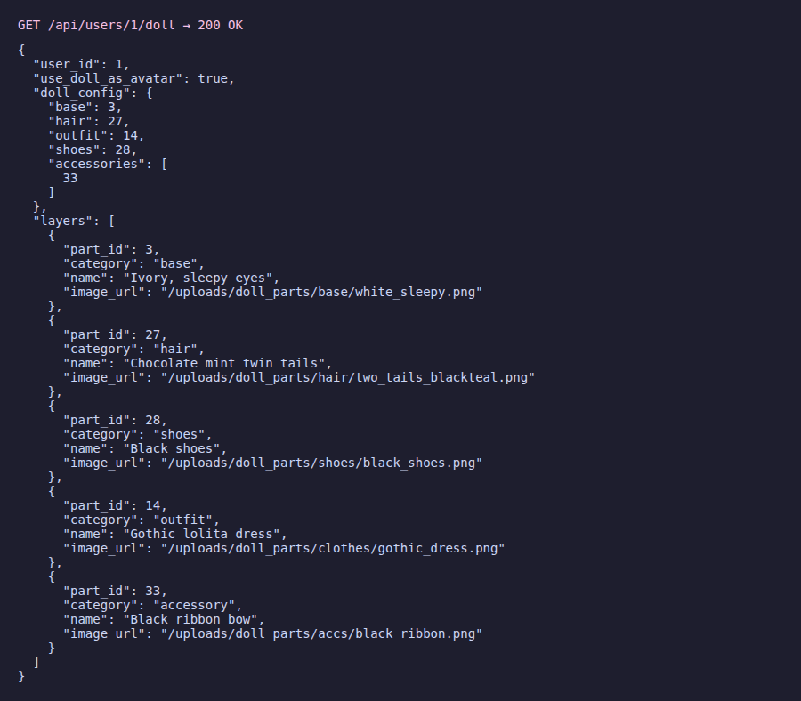

# Dollique API 🧸

> **Dollique** is a Q&A community backend for doll customizers, OOAK (One Of A Kind) artists and figure collectors: people ask about repaints, reroots, sealants and joint repairs, share restoration guides and vote for the most useful answers.

Built as Part 1 (Backend API) of the **USOF Challenge**, Full Stack track.



---

## Contents

- [Features](#features)
- [Tech stack](#tech-stack)
- [Getting started](#getting-started)
- [Admin panel](#admin-panel)
- [Project structure](#project-structure)
- [Database](#database)
- [API](#api)
- [How it works](#how-it-works)
- [Progress by CBL stages](#progress-by-cbl-stages)

---

## Features

**Required by the task**
- Registration with email confirmation, login by login or email, logout, password reset by email.
- Users, posts, categories, comments, likes/dislikes on posts and comments, with full CRUD.
- Two roles: `user` and `admin`. Admins manage everything through the API and the admin panel.
- Posts are sorted by likes by default (or by date), filtered by categories, date range and status, and paginated.
- Posts and comments can be made inactive (blocked): inactive content is visible only to its author and admins.
- User rating is calculated automatically from the likes and dislikes on their posts and comments.
- The database is recreated by one command and seeded with at least 5 rows in every table.

**Extra (creative part)**
- **Profile doll.** Every user can assemble a pixel doll from a catalog of PNG layers (body, hair, outfit, shoes, up to 3 accessories) and, if they want, show it instead of their profile picture. Admins manage the catalog.
- **Favorites.** Users save useful posts to a personal list.
- **Moderation with appeals.** An admin hides a post with a reason, the author gets a notification and can appeal. If the appeal is not approved in time, the post is deleted automatically.
- **Notifications** about moderation, appeals, category decisions, strikes and bans.
- **User-suggested categories.** Users propose categories, admins approve or reject them.
- **Strikes and auto-ban.** Moderated content gives the author a strike; 3 active strikes ban the account for 7 days. Admins can also ban, unban and reset parts of a profile.
- **Security.** bcrypt passwords, JWT that is revoked on logout and password change, a login attempt limiter, and validation of every input.

---

## Tech stack

| Part | Choice |
| :--- | :--- |
| Runtime | Node.js 18+ |
| Framework | Express 5 |
| Database | MySQL 8 via `mysql2/promise`, plain SQL |
| Auth | `jsonwebtoken` (JWT) + `bcrypt` |
| Uploads | `multer` (files stored in `uploads/`) |
| Email | `nodemailer` (Gmail SMTP, or an Ethereal test inbox when SMTP is not set) |
| Other | `cors`, `dotenv`, `nodemon` for development |

Architecture: MVC with OOP. Routes declare endpoints, controllers check the request and rights, models (ES6 classes with static methods) run SQL, and services hold shared business logic (rating, email, tokens, moderation, strikes, the doll).

---

## Getting started

### 1. Requirements
- [Node.js](https://nodejs.org/) 18 or newer
- MySQL 8 running locally

### 2. Install
Open the project folder (the root of this repository, where `package.json` is) in a terminal and install the dependencies:
```bash
npm install
```

### 3. Configure
Copy `.env.example` to `.env` and fill in your MySQL password and a JWT secret:

```env
PORT=3000
DB_HOST=localhost
DB_PORT=3306
DB_USER=root
DB_PASSWORD=your_mysql_password
DB_NAME=dollique_db
JWT_SECRET=your_jwt_secret_key_here

# Optional: real emails through Gmail (an app password, not your normal one)
SMTP_USER=your_email@gmail.com
SMTP_PASS=your_gmail_app_password

# Optional tuning
MODERATION_GRACE_DAYS=7      # days before a hidden post is deleted
MODERATION_CHECK_MINUTES=60  # how often the server looks for such posts
BAN_STRIKES=3                # active strikes that ban a user
BAN_DAYS=7                   # length of an automatic ban
```

Keep `PORT=3000`: the links in confirmation and password reset emails point to `http://localhost:3000`.

Without `SMTP_USER` / `SMTP_PASS` the server still works: letters go to a free [Ethereal](https://ethereal.email) test inbox instead of the real address, and the server console prints a link to open each letter (`📬 [TEST INBOX] ...`), so you can follow the confirmation or reset link from there.

### 4. Create the database
```bash
npm run db:init
```
This drops and recreates `dollique_db` from `database/schema.sql` and fills every table with sample data (13 tables, at least 5 rows each).

Sample accounts, all with the password `password123`:

| Login | Role |
| :--- | :--- |
| `dollique_admin` | admin |
| `ooak.amy`, `draculaura.og`, `alex.figures`, `monix.dolls` | user |

### 5. Run
```bash
npm run dev   # with auto-restart
npm start     # plain start
```
- API: `http://localhost:3000/api`
- Health check: `http://localhost:3000/api/health`
- Admin panel: `http://localhost:3000/admin`

---

## Admin panel

A single-page admin panel lives in `public/admin/index.html` and talks to the same API with the admin's JWT.

| | |
| :---: | :---: |
|  |  |
| Login | Users, roles, rating and strikes |
|  |  |
| Posts and comments moderation | Categories, including user suggestions |
|  |  |
| Appeals against moderation | Doll parts catalog |

---

## Project structure

```text
./
├── database/
│   ├── db.js              # MySQL connection pool
│   ├── schema.sql         # all tables, keys and constraints
│   └── initDb.js          # recreates the DB and seeds it (npm run db:init)
├── public/admin/          # admin panel (HTML + JS)
├── src/
│   ├── app.js             # Express app: middlewares, static files, routes, error handler
│   ├── server.js          # entry point: DB check, listen, moderation scheduler
│   ├── routes/            # endpoint declarations
│   ├── controllers/       # request validation, access rules, responses
│   ├── models/            # SQL queries, one class per entity
│   ├── middlewares/       # auth (required / optional), admin check, file uploads
│   ├── services/          # rating, email, tokens, login limiter, moderation, strikes, doll
│   └── utils/validators.js
├── uploads/
│   ├── avatars/           # profile pictures (default.png ships with the repo)
│   ├── posts/             # post images
│   └── doll_parts/        # doll layers: base/, hair/, clothes/, shoes/, accs/
├── docs/screenshots/
├── .env.example
└── package.json
```

---

## Database

| Table | What it stores |
| :--- | :--- |
| `users` | accounts, role, rating, profile picture, `doll_config`, `use_doll_as_avatar`, bio, ban |
| `tokens` | email confirmation and password reset tokens |
| `categories` | categories with status `pending` / `approved` / `rejected` |
| `posts` | posts with status `active` / `inactive` and moderation fields |
| `post_categories` | many-to-many link between posts and categories |
| `post_images` | up to 5 images per post |
| `comments` | comments and replies (`parent_id`), status `active` / `inactive` |
| `likes` | likes and dislikes on posts or comments |
| `favorites` | saved posts |
| `notifications` | messages to users |
| `appeals` | appeals against hidden posts |
| `violations` | strikes used by the auto-ban |
| `doll_parts` | the doll layer catalog |

Integrity rules live in the schema: foreign keys with `ON DELETE CASCADE` (deleting a user removes their posts, comments and votes), unique `login`, `email` and category `title`, and unique `(author_id, post_id)` / `(author_id, comment_id)` in `likes`, so one person can vote only once per post or comment.

---

## API

All bodies are JSON unless the endpoint uploads a file (`multipart/form-data`). Protected endpoints need `Authorization: Bearer <token>`. Errors come back as `{ "error": "..." }` with a matching HTTP status.

### Auth `/api/auth`
| Method | Endpoint | Description | Access |
| :--- | :--- | :--- | :--- |
| POST | `/register` | Register: `login, password, password_confirmation, email`, optional `full_name` | Public |
| GET / POST | `/confirm-email/:confirm_token` | Confirm the email from the letter | Public |
| POST | `/login` | Log in with `login` or `email` + `password` (email must be confirmed) | Public |
| POST | `/logout` | Log out: all tokens of the user stop working | User |
| POST | `/password-reset` | Send a reset link to `email` | Public |
| GET / POST | `/password-reset/:confirm_token` | GET checks the link, POST sets password, password_confirmation | Public |

### Users `/api/users`
| Method | Endpoint | Description | Access |
| :--- | :--- | :--- | :--- |
| GET | `/` | All users | Public |
| GET | `/:user_id` | One user | Public |
| GET | `/:user_id/doll` | The user's doll as ordered layers + `use_doll_as_avatar` | Public |
| POST | `/` | Create a user or admin: `login, password, password_confirmation, email, role` | Admin |
| PATCH | `/avatar` | Upload a profile picture (field `avatar`) | User |
| PATCH | `/:user_id` | Update `login, full_name, email, bio, doll_config, use_doll_as_avatar` (`role` for admins) | Owner / Admin |
| DELETE | `/:user_id` | Delete the account | Owner / Admin |
| POST | `/:user_id/profile-reset` | Reset `fields` (`profile_picture`, `full_name`, `bio`) with a `reason` | Admin |
| GET | `/:user_id/violations` | Strike history | Owner / Admin |
| POST / DELETE | `/:user_id/ban` | Ban (`days`, `reason`) / unban | Admin |

### Posts `/api/posts`
| Method | Endpoint | Description | Access |
| :--- | :--- | :--- | :--- |
| GET | `/` | Posts. Query: `page`, `limit`, `sort=likes\|date`, `order=desc\|asc`, `search`, `categories=1,2`, `date_from`, `date_to`, `status=active\|inactive` | Public |
| GET | `/favorites` | My saved posts | User |
| GET | `/:post_id` | One post | Public* |
| POST | `/` | Create: `title, content, categories`, up to 5 files in `images` | User |
| PATCH | `/:post_id` | Author edits `title, content, categories, status`; admin can hide or restore with a `reason` | Author / Admin |
| DELETE | `/:post_id` | Delete | Author / Admin |
| POST | `/:post_id/appeal` | Appeal a hidden post with a `message` | Author |
| POST | `/:post_id/favorite` | Save / unsave | User |
| GET | `/:post_id/categories` | Categories of the post | Public* |
| GET / POST / DELETE | `/:post_id/like` | List votes / vote (`type: like\|dislike`) / remove my vote | Public* / User |
| GET / POST | `/:post_id/comments` | List comments / add one (`content`, optional `parent_id` for a reply) | Public* / User |

\* An inactive post and everything attached to it answers `404` to everyone except its author and admins.

### Comments `/api/comments`
| Method | Endpoint | Description | Access |
| :--- | :--- | :--- | :--- |
| GET | `/:comment_id` | One comment | Public* |
| PATCH | `/:comment_id` | Author edits `content`; author or admin changes `status` (`active` / `inactive`) | Author / Admin |
| DELETE | `/:comment_id` | Delete | Author / post author / Admin |
| GET / POST / DELETE | `/:comment_id/like` | List votes / vote / remove my vote | Public* / User |

### Categories `/api/categories`
| Method | Endpoint | Description | Access |
| :--- | :--- | :--- | :--- |
| GET | `/` | Approved categories (admins see all, authors also see their own suggestions) | Public |
| GET | `/:category_id` | One category | Public |
| GET | `/:category_id/posts` | Posts in the category | Public |
| POST | `/` | Create: `title, description`. From an admin it is approved at once, from a user it becomes a `pending` suggestion | User / Admin |
| PATCH | `/:category_id` | Edit, or approve / reject with `status` and `reason` | Admin |
| DELETE | `/:category_id` | Delete | Admin |

### Doll parts `/api/doll-parts`
| Method | Endpoint | Description | Access |
| :--- | :--- | :--- | :--- |
| GET | `/` | Catalog, `?category=base\|hair\|outfit\|shoes\|accessory`. Admins also see retired parts and how many users wear each | Public |
| GET | `/:part_id` | One part | Public |
| POST | `/` | Add a part: transparent PNG in `image`, `name`, `category`, optional `layer`, `is_active` | Admin |
| PATCH | `/:part_id` | Edit or retire (`is_active: false`) a part | Admin |
| DELETE | `/:part_id` | Delete a part nobody wears | Admin |

### Appeals `/api/appeals` and notifications `/api/notifications`
| Method | Endpoint | Description | Access |
| :--- | :--- | :--- | :--- |
| GET | `/api/appeals` | All appeals | Admin |
| GET | `/api/appeals/:appeal_id` | One appeal | Author / Admin |
| PATCH | `/api/appeals/:appeal_id` | Decide: `status` (`approved` / `rejected`), `admin_response` | Admin |
| GET | `/api/notifications` | My notifications | User |
| PATCH | `/api/notifications/read-all` | Mark all as read | User |
| PATCH | `/api/notifications/:notification_id/read` | Mark one as read | User |
| DELETE | `/api/notifications/:notification_id` | Delete one | User |

### Example: a profile doll

A doll is stored as part IDs, `{"base":3,"hair":27,"outfit":14,"shoes":28,"accessories":[33]}`, and the API returns its pictures in drawing order. The frontend stacks them on top of each other, first one at the bottom.



---

## How it works

**A request.** The request is handled by `app.js`: CORS and JSON parsing are done before routing. Once the route is called, the process starts with middleware execution in which `authMiddleware` checks the JSON Web Token (JWT), `optionalAuthMiddleware` extracts the token once it exists to get different results for both guests and authenticated users in the same route; `roleMiddleware` grants access to the administrator only; and `uploadMiddleware` stores files that have been uploaded using Multer. Then, the controller handles validation of the data and the possible actions, the model performs SQL queries, and JSON response is returned.

**Registration and login.** In the process of registration, the password is hashed with bcrypt, the confirmation token is created randomly and the email with a link to confirm it is sent to the user. Login can take place only after confirming the email. After successful login, the JSON Web Token is generated for 24 hours, which contains the `token_version` of the user. Logging out and resetting the password result in increasing `token_version`, which makes all tokens previously generated invalid immediately. In case of multiple login failures from one IP-address, the login is blocked for 15 minutes.

**Posts and visibility.** `GET /api/posts` builds a single SQL query depending on the selected filter – categories, period, and status. As a result, the obtained dataset is sorted according to the balance of likes (or according to the dates) and then paginated. According to the rules of access control, guests see only active posts, authors are allowed to see their inactive posts, and administrators can see all posts. In addition, the principle of access control applies to associated objects such as comments, likes, and post categories.

**Votes and rating.** The vote means a row in the `likes` table. A unique key allows users to place one vote per post and one per comment. Voting again switches the vote between like and dislike. After every vote, the `RatingService` updates the author’s rating which equals the difference between likes and dislikes of the author's posts and comments.

**Moderation.** Whenever an admin hides a post, an explanation and a date of removal will be added to the post, the writer will get a notification, and a strike will be handed out. An appeal can be submitted by the writer, but only one appeal is allowed at any particular time, and no more appeal is possible following a rejected appeal. If an appeal is granted, then the post is restored, and the strike is wiped out, while if it is not, then the countdown proceeds. There is a scheduler in `server.js` that deletes the post once its lifespan ends.

**The doll.** `DollService` checks whether a `doll_config` is valid or not. In particular, it checks that there is a body, each ID refers to an existing item and is from a certain category, the amount of accessories does not exceed three, and retired parts can be kept only by users who already wear them; nobody new can pick them. For requesting a doll, the service gets all the parts and sorts them according to `layer`. The drawing order (layer) is: base (10), hair and shoes (20), outfits (30), accessories (50); higher layers are drawn on top. Also, a part which is currently worn cannot be deleted, only retired.

---

## Progress by CBL stages

**Engage.** I chose a niche that interests me and that I thought would make an unusual idea: doll customizing and figure collecting. Generic Q&A sites don't handle this community well: questions about materials, repaints and authenticity get lost, and good answers are hard to find. So the idea became a Q&A platform where the community votes useful answers up.

**Investigate.** I studied the USOF requirements and broke them into entities: users, posts, categories, comments, likes. Then I designed the relational schema with foreign keys and unique constraints and chose the stack: Express, MySQL with `mysql2` and plain SQL, following the MVC structure required by the task.

**Act.**
1. Base API: authentication with email confirmation, CRUD for all entities, likes, rating, sorting, filters and pagination.
2. Access rules for inactive content, admin panel, seed data in every table.
3. Moderation flow: hidden posts with reasons, notifications, appeals, automatic deletion, user-suggested categories.
4. Strikes and auto-ban, profile reset by admins, security fixes: token revocation, login limiter, safer uploads.
5. Creative feature: the profile doll. I created the part images, built the catalog with admin management, and added the option to use the doll instead of the profile picture.

**Next steps.** A frontend (USOF Part 2).
